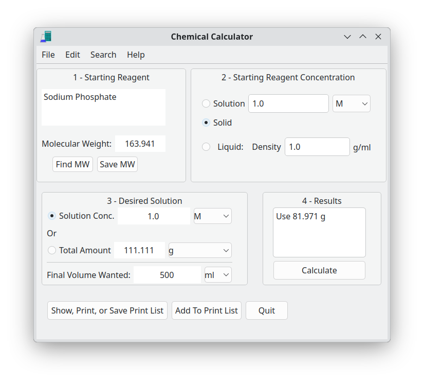
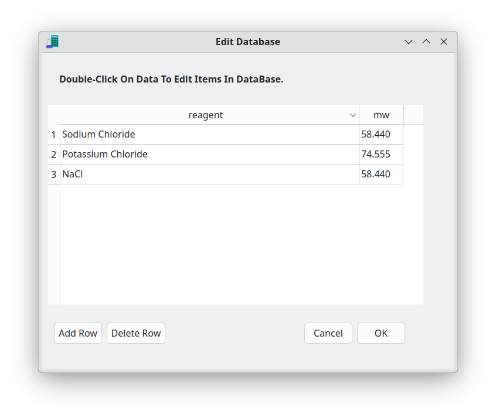
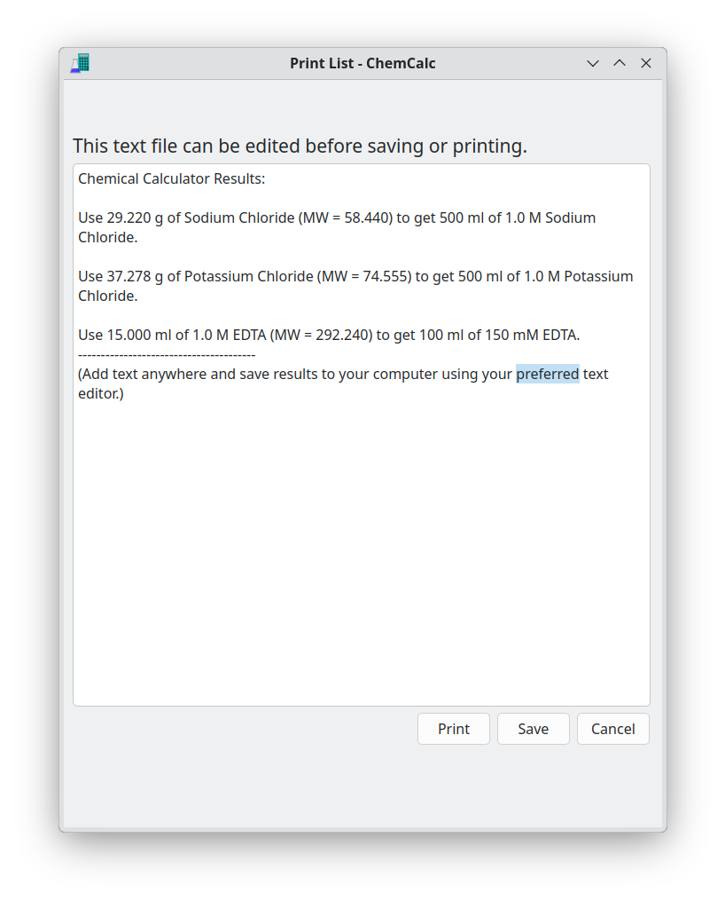

*NOTE: (November 13, 2025) DO NOT USE THIS YET.*

**ChemCalc (Chemical Calculator) is an application that calculates the amount of reagents to
use when mixing up chemical solutions.**

It is intended for use by chemists and other scientists who have enough knowledge and experience to use it safely.

Chemical Calculator  was written and copyrighted by Chris Baba in 2024.
It is open source software licensed under GPLv3 or later.

# Screenshots:

